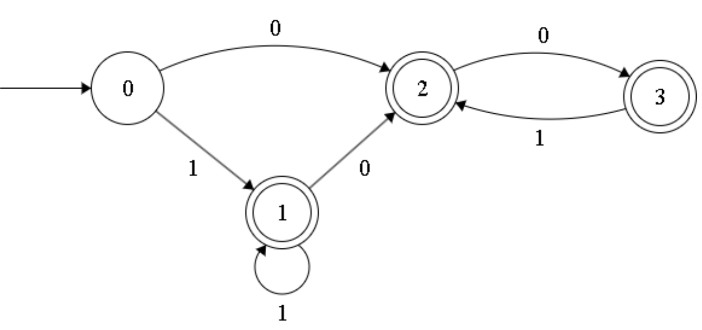

# TP1
Autor: Pedro Dong Mo

## Resumo
Expressão regular: Strings binárias que não incluem a subsequência "011"

## Lista de resultados
Fiz um automata para resolver este problema

Com a ajuda do automata, fiz a expressão caso não possa existir strings nulas:
`(1+(0|01)*| 0(0|01)*)`

caso possa existir:
`1*(0|01)*`
